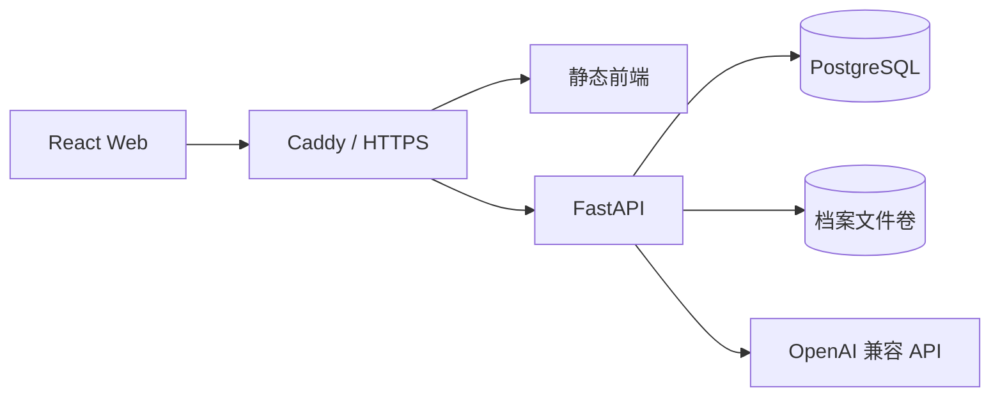

# 归源 · 家族记忆助手技术方案

> 状态：讨论稿。用于确定 MVP 的实现边界，确认后再拆分为具体实施计划。

## 1. 技术目标

本方案服务于单管理员、单台 Linux VPS 的 MVP，优先保证：

- 族谱事实和亲属关系计算准确、可测试。
- 智能体回答能够关联正式数据和资料来源。
- 模型只能提出变更，不能绕过管理员确认直接写入。
- 图片、PDF 和文字资料能够私密保存、备份和恢复。
- 部署结构简单，不提前引入图数据库、消息队列或多智能体框架。

## 2. 总体架构



系统采用前后端分离，但保留在同一仓库和同一套 Docker Compose 中。Caddy 提供 HTTPS、静态文件和 `/api` 反向代理；FastAPI 统一处理身份验证、族谱业务、档案访问、智能体编排和操作日志。

## 3. 技术栈

| 层级 | 选择 | 用途 |
| --- | --- | --- |
| 前端 | React、TypeScript、Vite | 延续当前 Demo，构建管理界面和智能体聊天页 |
| 后端 | Python、FastAPI、Pydantic | API、输入校验、业务流程和模型工具 |
| 数据访问 | SQLAlchemy、Alembic | 数据访问和数据库迁移 |
| 数据库 | PostgreSQL | 人物、关系、来源、草稿和日志 |
| 模型接入 | OpenAI Python SDK + 内部适配层 | 连接托管的 OpenAI 兼容 API |
| 文件存储 | Docker 持久化卷 | 保存图片、PDF 和文字原件 |
| 入口服务 | Caddy | HTTPS、静态资源和 API 反向代理 |
| 部署 | Docker Compose | 在单台 Linux VPS 上运行和升级 |
| 测试 | Vitest、Testing Library、Pytest、Playwright | 前端、后端和核心流程验证 |

依赖版本在开始实现时锁定到当时受支持的稳定版本，不在方案阶段追逐最新版本。

## 4. 仓库结构

保留当前前端目录，新增后端和部署目录，避免为了形式重构已完成的 Demo：

```text
src/                    # React 前端
backend/
  app/
    api/                # HTTP 路由
    domain/             # 人物、关系、来源等领域规则
    services/           # 用例和事务编排
    repositories/       # PostgreSQL 数据访问
    agent/              # 模型适配与工具定义
  tests/
docs/
infra/                  # Caddy 与部署配置
compose.yaml
```

后端模块之间通过明确的服务接口协作，API 路由不直接操作数据库，模型工具也不直接执行任意 SQL。

## 5. 核心后端模块

### 5.1 身份验证

只提供单管理员账号。使用密码哈希、服务端会话和安全 Cookie，不引入注册、第三方登录和复杂权限系统。

### 5.2 族谱领域

负责人物、父母子女、配偶、兄弟姊妹、堂兄弟姊妹关系、关系校验和路径计算。亲属称谓由确定性规则生成，不交给模型猜测；出生信息不足时不区分长幼。

### 5.3 资料档案

负责上传、下载、元数据、人物关联和来源标记。文件本体保存在持久化卷，数据库保存路径、哈希、类型、大小和关联信息。

### 5.4 变更草稿

保存智能体或表单产生的待确认变更。草稿包含原始输入、结构化变更、校验结果、状态和创建时间；只有确认接口能在数据库事务中写入正式数据。

### 5.5 智能体编排

负责识别问题类型、调用受限业务工具、组装来源并生成回答。模型服务不可用时，普通族谱管理仍应正常工作。

### 5.6 审计与备份

记录操作者、操作类型、对象、变更摘要和时间。备份同时覆盖 PostgreSQL 和档案文件卷，并定期验证恢复流程。

## 6. 数据模型方向

MVP 使用以下核心实体：

- `admin_users`：唯一管理员和密码哈希。
- `persons`：人物身份及基础资料。
- `relationships`：父母子女和配偶关系。
- `sources`：照片、PDF、文字记录及其元数据。
- `source_links`：资料与人物、关系或具体字段之间的证据关联。
- `change_drafts`：待确认、已确认或已拒绝的结构化变更。
- `audit_logs`：正式写入和管理操作记录。

关系记录采用稳定的人物 ID，不以姓名作为关联键。父母关系有方向，配偶关系按无方向关系处理；服务层需要阻止重复关系、自我关联和祖先循环。

每条重要事实和关系都可以关联来源，并标记为“已核实”“待核实”或“存在冲突”。可信度来自来源状态和规则，不使用模型自报的概率。

## 7. 核心业务流程

### 7.1 亲属关系问答

1. 模型把问题解析为结构化查询意图和人物名称。
2. 后端解析人物身份；遇到重名时要求管理员选择，不静默猜测。
3. 关系引擎从正式关系数据计算路径和称谓。
4. 来源服务读取相关证据和核实状态。
5. 模型只负责把确定的路径与证据组织成中文回答。
6. API 返回回答、关系路径、引用来源和核实状态。

找不到可靠路径或来源冲突时，回答应明确显示“不确定”或“待核实”。

### 7.2 智能体辅助录入

1. 模型将自然语言解析为符合 Pydantic 模型的结构化草稿。
2. 后端检查必填字段、重名、重复关系和祖先循环。
3. 系统保存 `change_draft`，返回变更预览，不修改正式数据。
4. 管理员确认时，服务层重新校验草稿和当前数据版本。
5. 通过后在单个数据库事务中写入，并追加审计日志。

拒绝、过期或校验失败的草稿不得写入。确认接口不接受前端临时拼装的新内容，只接受服务端已保存的草稿 ID。

### 7.3 档案上传

1. 后端校验文件大小、MIME 类型和扩展名。
2. 使用随机文件名保存，计算内容哈希，原始文件名只作为元数据。
3. 管理员填写来源、年代、摘要和人物关联。
4. PDF 文本提取可在 API 后台任务中执行；MVP 不引入独立任务队列。

## 8. API 边界

第一版按资源划分以下 API：

- `/api/auth`：登录、退出和当前管理员。
- `/api/persons`：人物查询和维护。
- `/api/relationships`：关系维护与路径查询。
- `/api/sources`：档案上传、下载和关联。
- `/api/agent/query`：智能体问答。
- `/api/change-drafts`：查看、确认和拒绝草稿。
- `/api/audit-logs`：操作记录查询。

所有写接口由后端进行权限和业务校验。前端只负责展示与提交意图，不能成为数据一致性的唯一防线。

## 9. 模型接入方案

后端设置统一的 `ModelClient` 接口，隐藏不同兼容服务在地址、模型名和能力上的差异。首版优先采用兼容范围更广的 Chat Completions 调用；只有当具体服务明确支持时，才启用 Responses API、严格 Structured Outputs 或工具调用。

模型接入遵守以下约束：

- API 地址、模型和密钥只存在于服务端配置中，浏览器不能读取密钥。
- 结构化结果必须经过 Pydantic 二次校验，校验失败不会生成草稿。
- 模型只能调用白名单工具：查人物、查关系、查来源和创建草稿。
- 正式写入、删除、备份和恢复不作为模型工具开放。
- 设置超时、有限重试和清晰错误提示，不在日志中记录密钥或完整敏感资料。
- 保存提示词版本和模型调用元数据，不保存模型内部推理内容。

OpenAI 官方文档表明 Responses API 支持函数工具与 JSON Schema 结构化输出；本项目通过适配层使用这些能力，同时保留对能力较少的兼容服务的降级路径。

## 10. 安全与隐私

- 密码使用 Argon2id 等专用密码哈希算法保存。
- 登录状态使用 `HttpOnly`、`Secure`、`SameSite` Cookie，写操作增加 CSRF 防护。
- 档案下载必须经过身份验证，不直接暴露文件卷路径。
- 上传文件设置大小和类型限制，阻止路径穿越和可执行文件访问。
- 模型密钥和数据库密码不进入 Git；MVP 从服务器环境变量读取。
- 发送给模型的数据遵循最小必要原则，未参与当前问题的档案不进入上下文。
- 删除和批量修改需要二次确认，并写入审计日志。

## 11. 部署与备份

Docker Compose 包含三个主要服务：

- `proxy`：Caddy，提供 HTTPS、前端静态文件和反向代理。
- `api`：FastAPI 应用。
- `db`：PostgreSQL。

使用独立持久化卷保存数据库和档案文件，容器更新不能删除数据。服务配置健康检查和自动重启策略，数据库端口不直接暴露到公网。

备份至少包含数据库导出、档案文件和必要配置。建议保留每日与每周备份，并定期在临时环境执行恢复演练；只有“能够成功恢复”的备份才视为有效。

## 12. 测试策略

- 前端单元与交互测试：页面状态、表单、草稿预览和确认流程。
- 后端单元测试：关系路径、中文称谓、重名、重复关系和循环校验。
- 数据库集成测试：迁移、事务、草稿确认、来源关联和审计日志。
- 模型契约测试：使用假模型响应验证结构化解析、降级和错误处理，不依赖真实 API。
- 端到端测试：登录、建立族谱、上传资料、关系问答、确认写入和重新查询。
- 部署验证：容器健康检查、数据库备份及恢复演练。

每个功能改动都要先定义可验证结果，更新相应测试；合并或交付前必须运行完整测试与生产构建。

## 13. 实施顺序

1. 后端骨架、数据库迁移、单管理员登录和容器开发环境。
2. 人物、关系、确定性关系引擎和族谱前端联调。
3. 档案上传、来源关联和受保护下载。
4. 模型适配层、关系问答和引用展示。
5. 变更草稿、管理员确认、审计日志和备份恢复。
6. 端到端验收与 VPS 部署文档。

## 14. MVP 明确不采用

- Neo4j 或其他独立图数据库。
- Redis、Celery 或独立消息队列。
- LangChain 等大型 Agent 编排框架。
- Kubernetes、微服务拆分和多节点部署。
- 模型直接写数据库或自动批准变更。

这些能力只有在实际数据规模或运行指标证明必要时再引入。

## 15. 参考资料

- [FastAPI 类型与自动校验](https://fastapi.tiangolo.com/python-types/)
- [PostgreSQL 递归查询](https://www.postgresql.org/docs/17/queries-with.html)
- [Docker Compose 单服务器生产部署](https://docs.docker.com/compose/how-tos/production/)
- [OpenAI Responses API](https://developers.openai.com/api/reference/cli/resources/responses/methods/create)
